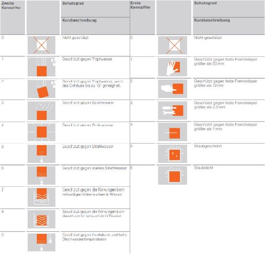
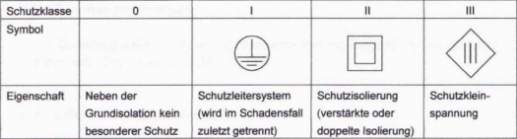
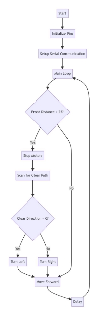
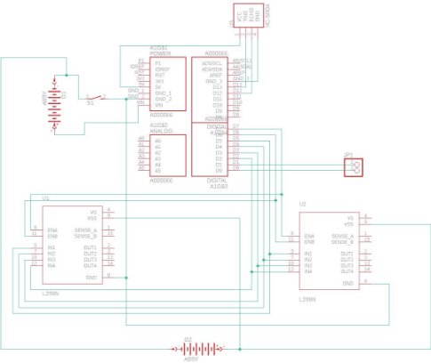

Universität Rostock

Fakultät für Informatik und Elektrotechnik Fachbereich Elektrotechnik

Wintersemester 2023/24 Lehrveranstaltung Projekt Elektrotechnik

**Iheb Mrabet Max Balbach**

**Schildkröte**

1. [**Themenstellung.......................................................................................................................................... 3**](#_page2_x72.00_y86.10)
1. [**Themenpräzisierung...............................................................................................................................3**](#_page2_x72.00_y213.05)
1. [**Einleitung...................................................................................................................................................... 3**](#_page2_x72.00_y325.89)
1. [Gerä tebeschreibung...................................................................................................................................3](#_page2_x72.00_y424.62)
1. [Funktionsbeschreibung..........................................................................................................................3](#_page2_x72.00_y593.88)
1. [Einsatzmöglichkeiten des Gerätes..................................................................................................4](#_page3_x72.00_y72.00)
4. [**Mechanische Baugruppen..................................................................................................................4**](#_page3_x72.00_y241.26)
1. [Gehä usea ufba u.............................................................................................................................................4](#_page3_x72.00_y339.99)
1. [Dimensionierung des Gehäuses.......................................................................................................4](#_page3_x72.00_y495.14)
1. [Konstruktive Lösung/Variantendiskussion..............................................................................5](#_page4_x72.00_y72.00)
1. [Einordnung und Befestigung der Baugruppen im Gehäuse......................................5](#_page4_x72.00_y311.78)
1. [Schutzgrad und Schutzklasse...........................................................................................................5](#_page4_x72.00_y692.61)
1. [Preis und Stückliste des Gehäuses.................................................................................................7](#_page6_x72.00_y237.31)
5. [**Elektronische Baugruppen..................................................................................................................7**](#_page6_x72.00_y438.43)
1. [Scha ltunga ufba u..........................................................................................................................................7](#_page6_x72.00_y523.06)
1. [Spa nnungsversorgung............................................................................................................................7](#_page6_x72.00_y678.21)
1. [Leiterpla ttenkonstruktion.....................................................................................................................8](#_page7_x72.00_y128.42)
1. [Herstellung der Leiterpla tte.....................................................................................................8](#_page7_x72.00_y213.05)
1. [Leiterpla ttenbestückung............................................................................................................8](#_page7_x72.00_y311.78)
4. [Betrachtung der Wärmeabfuhr.........................................................................................................8](#_page7_x72.00_y424.62)
5. [Preis und Stückliste der Elektronik.................................................................................................8](#_page7_x72.00_y509.25)
6. [**Programmierung........................................................................................................................................9**](#_page8_x72.00_y194.53)
1. [Beschreibung...................................................................................................................................................9](#_page8_x72.00_y250.95)
1. [PIN-Verbindungen......................................................................................................................................10](#_page9_x72.00_y72.00)
7. [**Testen des Gerätes...................................................................................................................................10**](#_page9_x72.00_y490.63)
1. [Aufgetretene Fehler - Ursa chen........................................................................................................10](#_page9_x72.00_y561.15)
1. [Fehlerbetra chtung......................................................................................................................................11](#_page10_x72.00_y86.11)
1. [Ka librierung der Ska len...........................................................................................................................11](#_page10_x72.00_y311.78)
8. [**Elektromagnetische Verträglichkeit...............................................................................................11**](#_page10_x72.00_y466.93)
9. [**Umweltverträglichkeit und Entsorgung........................................................................................11**](#_page10_x72.00_y636.19)
9. [**Zusätzliche Erläuterungen zum Beleg.......................................................................................12**](#_page11_x72.00_y256.26)
9. [**Eigenständigkeitserklärung..............................................................................................................12**](#_page11_x72.00_y411.41)
9. [**Literaturverzeichnis / Verwendete Software...........................................................................12** ](#_page11_x72.00_y510.14)[Litera turverzeichnis..........................................................................................................................................12 ](#_page11_x72.00_y552.46)[Verwendete Softwa re........................................................................................................................................13 ](#_page12_x72.00_y213.05)[Prä senta tionen.....................................................................................................................................................13](#_page12_x72.00_y382.30)
9. [**Anhang........................................................................................................................................................14**](#_page13_x72.00_y72.00)
1. [Schemazeichnung des Schaltplans..................................................................................................14](#_page13_x72.00_y100.21)
1. [Aufba u der Pla tine........................................................................................................................................14](#_page13_x72.00_y440.33)
1. [Technische Aufba u.......................................................................................................................................14](#_page13_x72.00_y728.56)
1. [Fertige Aufba u.................................................................................................................................................16](#_page15_x72.00_y72.00)
1. **Themenstellung**

   Im Rahmen des vorliegenden Studienprojektes wurde die Entwicklung eines autonomen Roboters, genannt "Schildkröte", durchgeführt. Der Schwerpunkt lag dabei auf der Implementierung von Sensorik zur Erfassung der Umgebung und der autonomen Navigation, basierend auf den Grundlagen der Robotik, Konstruktion, Elektronik und Programmierung.

2. **Themenpräzisierung**

   Das Projekt "Schildkröte"verfolgt das Ziel, einen kostengünstigen, autonomen Roboter zu entwickeln, der sich für Bildungszwecke oder als Grundlage für weiterführende Entwicklungen eignet. Durch den Einsatz von Standardkomponenten und Open-Source-Programmierung soll eine modulare und anpassungsfähige Plattform gescha en werden.

3. **Einleitung**

Die "Schildkröte"ist ein Projekt, das aus der Notwendigkeit heraus entstanden ist, eine Plattform zu haben, die nicht nur lehrreich ist, sondern auch bei der Durchführung verschiedener Aufgaben in verschiedenen Umgebungen verwendet werden kann.

1. **Gerätebeschreibung**

Die "Schildkröte"ist ein autonomer Roboter, der auf einem erstellten Hülle aufgebaut ist. Die Hauptsteuereinheit ist ein Genuino 101, der die Interaktion zwischen Software und Hardware ermöglicht. Der Roboter ist mit einem Ultraschallsensor HC-SR04 für die Entfernungsmessung, einem vierrädrigen Antriebssystem, betrieben durch DC-Motoren, und einem Batteriesystem für die Energieversorgung ausgestattet. Der Aufbau beinhaltet auch zwei Motor-Treiber zur Steuerung der DC-Motoren, Batterien, eine selbstgebaute Leiterplatte zur Verbindung der Komponenten, und ein manuelles Steuerelement (Schalter).

2. **Funktionsbeschreibung**

Die Hauptfunktion der "Schildkröte"ist die autonome Navigation. Der Ultraschallsensor misst kontinuierlich den Abstand zu Hindernissen und sendet die Daten an den Genuino 101. Die Programmlogik, die in den Arduino eingebettet ist, entscheidet, wie der Roboter basierend auf diesen Daten navigiert, einschließlich wann er stoppt, seine Richtung ändert oder seine Geschwindigkeit anpasst. Der Knopf ermöglicht es dem Benutzer, die Bewegung des Roboters manuell zu steuern oder anzuhalten.

3. **Einsatzmöglichkeiten des Gerätes**

Die "Schildkröte"repräsentiert ein vielseitiges robotisches Konzept mit Potenzial für erweiterte Anwendungen. Sie könnte beispielsweise für logistische Aufgaben modifiziert werden, wie den automatisierten Transport von Waren. Eine Anpassung für Reinigungsprozesse ermöglicht ihren Einsatz in verschiedenen Umgebungen. Durch Integration in größere Automatisierungsprojekte, etwa durch Verbindung mit einem Roboterarm, kann sie diverse präzise Handhabungsaufgaben erfüllen. Ihre Flexibilität und Anpassungsfähigkeit erö nen neue Möglichkeiten in der Robotik-Forschung und praktischen Anwendung.

4. **Mechanische Baugruppen**

Dieser Abschnitt befasst dich mit den mechanischen Baugruppen des Gerätes, vordergründig mit dem Gehäuse, deren Dimensionen, Aufbau und Umsetzung.

Die technische Zeichnung befindet sich am Ende des Projekts.

1. **Gehäuseaufbau**

Das Gerät verfügt über ein vollständig mit einem 3D-Drucker hergestelltes Gehäuse, dessen maximale Außenabmessungen 150 mm × 80 mm × 53 mm (BxTxH) betragen. Als integraler Bestandteil des Designs wurde eine Leiterplatte, die direkt als Arduino-Shield dient, auf dem Arduino-Board montiert. Die Konstruktion des Gehäuses umfasst ferner spezielle Vorrichtungen zur Befestigung der Motorantriebe und des Ultraschallsensors sowie Aussparungen für die Durchführung der Verkabelung.

2. **Dimensionierung des Gehäuses**

Bei der Planung der Gehäuseabmessungen stand die sichere Unterbringung aller Komponenten im Fokus. Es wurde sorgfältig darauf geachtet, dass zwei 9V-Batterien mit Clips, vier DC-Motoren mit Rädern, der Arduino mit aufgesetztem Shield und ein Ultraschallsensor Platz finden. Die Breite des Gehäuses orientiert sich an der Summe der Breiten der beiden Motorantriebe zuzüglich eines angemessenen Abstands für die Verkabelung. Die Länge musste ausreichend sein, um den Arduino, die Motorantriebe und die Batterien nebeneinander anzuordnen. Die Höhe wurde so bemessen, dass sie nicht nur die Motorantriebe und Batterien aufnehmen kann, sondern im unteren Bereich auch die Höhe der DC-Motoren plus einem Sicherheitsabstand berücksichtigt. Darüber hinaus wurde im Design ein Stützeck vorgesehen, um das Gewicht des Roboters tragen zu können und zu gewährleisten, dass das Gehäuse auch unter Last nicht beschädigt wird.

3. **Konstruktive Lösung/Variantendiskussion**

Bei der konstruktiven Umsetzung des Gehäuses durch den 3D-Druckprozess wurde besonderes Augenmerk auf die Optimierung des Materialverbrauchs gelegt. Die Herausforderung bestand darin, die Stabilität des Gehäuses sicherzustellen, während gleichzeitig der Einsatz von Stützmaterial minimiert wurde, insbesondere da das Design eine große Hülle aufweist. Durch den Druck vom Unterbereich und die kompakte Form des Gehäuses konnte das Stützmaterial auf ein Minimum reduziert werden. Dies war nicht nur kostene zient, sondern auch umweltschonend, da weniger Abfallmaterial anfiel. Die Konstruktion der Stützecken wurde speziell angepasst, um die Lasten des Roboters zu tragen, ohne die gesamte Integrität des Designs zu beeinträchtigen. So entstand ein Gehäuse, das sowohl die Anforderungen an die Belastbarkeit als auch an die Wirtschaftlichkeit im 3D-Druckprozess erfüllt.

4. **Einordnung und Befestigung der Baugruppen im Gehäuse**

Die Anordnung der Baugruppen im Inneren des Gehäuses wurde strategisch geplant, um einen optimalen Schutz für die elektronischen Bauteile zu bieten und eine benutzerfreundliche Bedienung des Geräts zu ermöglichen. Während die meisten Komponenten mittels Schrauben und Muttern fest im Gehäuse verankert wurden, erfolgte die Befestigung des Ultraschallsensors durch eine formschlüssige und reibungs basierte Verbindung, die eine sichere und dennoch demontierbare Lösung darstellt. Für den Schalter wurde eine passgenaue Ö nung im Gehäuse vorgesehen, die eine direkte und werkzeuglose Montage ermöglicht. Die Batterieclips wurden mit Klettband fixiert, was eine stabile Stromversorgung gewährleistet und zugleich einen schnellen Batteriewechsel ohne zusätzliche Werkzeuge erlaubt. Diese spezifischen Befestigungsmethoden tragen dazu bei, die einzelnen Bauteile e ektiv vor Vibrationen und Stoß-Einwirkungen zu schützen und die Wartung des Geräts zu vereinfachen.

Jedoch sind der Arduino und die Motorantriebe jeweils nur mit 2 Schrauben verbunden, obwohl normalerweise 4 Schrauben verwendet werden sollten. Dies liegt daran, dass die Motoren auf der anderen Seite und darunter platziert sind, was die Nutzung einer vollständigen Schraubenverbindung unmöglich macht. Für den Prototyp reichen 2 Schrauben aus, aber für zukünftige Versionen müssen alternative Verbindungsmethoden oder eine andere Platzierung in Betracht gezogen werden.

5. **Schutzgrad und Schutzklasse**

Das Design des Gehäuses zielt darauf ab, die internen Komponenten e ektiv vor mechanischen Einwirkungen, wie Stößen durch Kollision mit Objekten, sowie vor schädlichen Umwelteinflüssen wie Staub und

Feuchtigkeit zu schützen. Der Schutz der Elektronik und die Betriebssicherheit des Geräts stehen im Vordergrund, um das Risiko von Beschädigungen zu minimieren. Entsprechend der IP-Norm DIN EN 60529 wurde das Gehäuse so konzipiert, dass es den Anforderungen des Schutzgrades IP22 gerecht wird, was bedeutet, dass es gegen das Eindringen von Fremdkörpern größer als 12,5 mm und gegen fallendes Tropfwasser geschützt ist, wenn das Gehäuse bis zu 15° geneigt ist. Gemäß der Norm DIN VDE 0702-1fällt das Gerät in die Schutzklasse 1, was vorschreibt, dass es mit einem Schutzleiter ausgestattet ist, der im Fehlerfall einen ausreichenden Schutz gegen elektrischen Schlag bietet. Diese Schutzmaßnahmen gewährleisten, dass die Sicherheit und Langlebigkeit des Geräts auch unter anspruchsvollen Bedingungen erhalten bleiben.

Abbildung 1: IP-Norm DIN EN 60529

Abbildung 2: DIN VDE 0702-1

6. **Preis und Stückliste des Gehäuses**

|Bezeichnung|Maße (mm)|Referenz|Stück|Preis (€)|
Gesamt

(€)
|
| - | - | - | - | :-: | - |
|Gehäuse|
150/80/

53
|3D Gedrückte|2|—-|—-|
|Klettband|—-|—-|—-|—-|—-|
|Schrauben + Muttern|—-|—-|14|—-|—-|

5. **Elektronische Baugruppen**

Im folgenden Abschnitt geben wir einen Einblick in unsere Planung und Umsetzung der elektronischen Bauelemente, sowie die Entscheidungen, die wir getro en haben.

1. **Schaltungaufbau**

Die Schaltung setzt sich aus den beiden, im Anhang befindlichen Plänen (Schaltplan und Layout) zusammen. Grob zusammengefasst ist eine Genuino 101mit einem Ultraschallsensor, den wir verwendet haben, um den Abstand zu Objekten auf der Fahrbahn zu ermitteln, den zwei DC Motoren zum Antrieb der Räder und den beiden Batterien verbunden. Zwischen dem Ground-Anschluss der Genuino und den beiden Minuspolen der Batterien befindet sich ein Schalter, mit dem der Roboter ein- und ausgeschaltet werden kann.

2. **Spannungsversorgung**

Die Spannungsversorgung erfolgt über zwei neun Volt Batterien. Die beiden Batterien haben eine zusammenhängende Masse, wobei der Pluspol der ersten Batterie mit Eingang für die Spannungsversorgung der Genuino verbunden ist und der Pluspol der anderen mit den beiden

DC Motoren. Sie sind über zwei Batterieclips mit dem Gehäuse verbunden. Da die Verbindung über ein Klettverschlussband erfolgt, stellt das Wechseln der Batterien kein Problem dar.

3. **Leiterplattenkonstruktion**

Die folgenden Abschnitte beinhalten die Entwicklung der Leiterplatte von der Planung bis hin zur Herstellung.

1. Herstellung der Leiterplatte

Das Layout der Leiterplatte ist im Anhang zu finden und wurde mit dem Programm “Eagle”entworfen. Die Produktion dieser erfolgte im Leiterplattenlabor der Universität Rostock, Fachbereich Informatik und Elektrotechnik.

2. Leiterplattenbestückung

Die Leiterplatte wurde gemäß des Schaltplans und dem dazu entsprechenden Leiterplattenlayouts bestückt. Die einzelnen Bauelemente wurden durch manuelles Löten auf der Leiterplatte befestigt, bzw. über die Leiterplatte mit der Genuino verbunden.

4. **Betrachtung der Wärmeabfuhr**

Die meiste Wärme bei diesem Aufbau entsteht in den beiden DC Motoren. Diese haben, um dem entgegenzuwirken, zwei passive Kühlkörper aufgebaut.

5. **Preis und Stückliste der Elektronik**

|Bezeichnung|Maße (mm)|Referenz|Stück|Preis (€)|
Gesamt

(€)
|
| - | - | - | - | :-: | - |
|Arduino|65/53|Genuino 101|1|42|42|
|Ultraschallsensor|—-|HC-SR04|1|3\.6|3\.6|
|Batterien|—-|9V Batterie|2|1|2|
|Batterie Clip|—-|—-|2|—-|—-|
|Leiterplatte|53/53|—-|1|—-|—-|
|Schalter|13/9|—-|1|1|1|
|
Motorantrieb

L298N
|43/43|KeeYees|2|||

|DC-Motor Räder|21/18 —-|
Motorantrie b Controller

Board
|4 4|20|20|
| :-: | :-: | - | - | - | - |
|Kabbel|—-|—-|—-|—-|—-|

6. **Programmierung**

   Zur Programmierung wird die Arduino IDE verwendet.

1. **Beschreibung**

Der Code ermöglicht es einem Roboter, autonom zu navigieren, indem er Hindernisse erkennt und vermeidet. Mithilfe eines Ultraschallsensors misst der Roboter die Entfernung zu Objekten vor ihm. Wenn ein Hindernis näher als 25 cm ist, stoppt der Roboter, sucht nach einem freien Weg, indem er sich links und rechts dreht, und fährt dann in die Richtung mit dem meisten freien Raum weiter. Der Roboter nutzt Motoren für die Bewegung und kann vorwärts fahren, anhalten, sowie nach links oder rechts drehen.

2. **PIN-Verbindungen**

 

|
PIN-Bezei

chnung
|Verbindungstyp|Beschreibung|PIN- Nummer|
| - | - | - | :- |
|in1|OUTPUT|
Steuert einen der

Motoren
|2|
|in2|OUTPUT|
Steuert einen der

Motoren
|3|
|in3|OUTPUT|
Steuert einen der

Motoren
|4|
|in4|OUTPUT|
Steuert einen der

Motoren
|5|
|trigPin|OUTPUT|Sendet Ultraschallsignale|13|
|echoPin|INPUT|Empfängt die reflektierten Ultraschallsignale|12|

Die Tabelle zeigt, welche PINs am Mikrocontroller für Motorsteuerung und Ultraschallsensorik zuständig sind, inklusive ihrer Funktionen und PIN-Nummern.

7. **Testen des Gerätes**

   Dieser Abschnitt befasst sich mit dem Testen und Kontrollieren des fertiggestellten Geräts und der Fehlerbetrachtung aufgetretener Fehler.

1. **Aufgetretene Fehler - Ursachen**

Der erste Fehler trat schon bei der Entwicklung des ersten Leiterplattenentwurfs auf. Die beiden Verbindungen der Enable A und B Anschlüsse der beiden DC Motoren wurden zuerst falsch verbunden, was wir leider erst bemerkten, als diese schon fertig hergestellt war und wir mit dem Löten begonnen hatten.

Des weiteren wurde die Spannungs nach ersten Belastungstest auf eine neun Volt Batterie festgelegt, was sich jedoch nach weiteren genaueren und längeren Test als zu wenig, bei unter anderem unebenen Boden herausstellte, bzw. die Laufzeit des Roboters auf eine sehr kurze Zeit beschränkt war. Dieses Problem ließ sich allerdings schnell beheben, indem eine weitere neun Volt Batterie hinzugefügt wurde.

2. **Fehlerbetrachtung**

Es können verschiedene Fehler auftreten:

Zum einen kann es passieren, dass ein Hindernis auf der Fahrbahn nicht erkannt wird, wenn es sich in einem ungünstigen Winkel zu dem Ultraschallsensor befindet, bzw. zu schmal ist, um genügend Ultraschallwellen zu reflektieren.

Des Weiteren kann es sein, dass sich der Roboter in einer Umgebung befindet, in der sich zu viele Objekte befinden und es außerdem nicht viel Platz gibt. Dafür ist die Genauigkeit des Ultraschallsensors nicht hoch genug, sodass es passieren kann, dass der Roboter immer wieder vor und zurück fährt, wodurch er dann nicht mehr aus dieser Umgebung kommt.

3. **Kalibrierung der Skalen**

Die Genauigkeit des Ultraschallsensors kann überprüft werden, indem man eine Referenz, wie zum Beispiel ein Lineal unter den Sensor legt und dann in einem bestimmten Abstand ein Objekt positioniert.

Nach vielen Stichproben kann festgehalten werden, dass der Sensor bis ungefähr 300 cm mit einer Genauigkeit von ± 0,5 cm messen kann. Das stimmt relativ genau mit dem Datenblatt des Herstellers überein. In diesem steht, dass der Sensor bis zu 3 m mit einer Genauigkeit von 3 mm messen können soll.

8. **Elektromagnetische Verträglichkeit**

   Es wurde keine Überprüfung zur elektromagnetischen Verträglichkeit durchgeführt, jedoch ist davon auszugehen, dass in diesem Zusammenhang keine Probleme auftreten sollten. In dem Aufbau werden keine größeren Frequenzen erzeugt, die zur Störung anderer Geräte führen könnten.

   Die gewöhnlichen elektrischen Felder, die in unserem Alltag auftreten, durch zum Beispiel Handys, Funkmasten, Radios, Stromleitungen und so weiter, haben keine messbare Auswirkung auf die Funktionsweise des Roboters.

9. **Umweltverträglichkeit und Entsorgung**

   Die Bauelemente unseres Geräts wurden online und aus dem Uni-Labor erworben, wobei besonderer Wert auf Umweltstandards gelegt wurde. Bei der Auswahl der Bauteile wurde darauf geachtet, dass diese am Ende ihrer Nutzungsdauer einfach zu entsorgen sind. Speziell die Batterien können problemlos bei jeder Batterie-Annahmestelle abgegeben werden. Das Gehäuse, gefertigt mittels 3D-Druck aus umweltfreundlichen und recycelbaren Kunststo en, unterstreicht unser

   Engagement für Nachhaltigkeit und minimiert den ökologischen Fußabdruck des Projekts. Diese Materialwahl erleichtert nicht nur die präzise und ressourcenschonende Produktion, sondern gewährleistet auch, dass das Gehäuse am Ende seines Lebenszyklus dem Recycling zugeführt werden kann.

   Die kontinuierliche Einhaltung der ROHS-Richtlinien für die online gekauften Bauelemente ist vorgesehen, um die Umweltverträglichkeit unseres Projekts zu sichern. Durch diese Maßnahmen wird sichergestellt, dass unser Gerät nicht nur in seiner Nutzung, sondern auch in seiner Entsorgung oder Recycling-Phase die Umwelt möglichst wenig belastet.

10. **Zusätzliche Erläuterungen zum Beleg**

    Es wurde überlegt, wie die Bauteile in zwei Bauteilgruppen unterteilt werden können. Es wird unterschieden zwischen den Bauteilen, die in dem Schaltplan vorkommen und nicht vorkommen.

    So wurde das Gehäuse, die Räder, das Klettverschlussband, die schrauben und Muttern, sowie die Batterieclips zu der Baugruppe des Gehäuses zugeordnet und die anderen Bauteile, also die Geduino, die DC Motoren, der Motorantrieb, die Leiterplatte die Kabel, die Batterien und der Schalter, der elektronischen Baugruppe zugeordnet.

11. **Eigenständigkeitserklärung**

    Hiermit erklären wir, Iheb Mrabet und Max Balbach, den Konstruktionsbeleg eigenständig und mit den nachstehend angegebenen Quellen verfasst zu haben.

12. **Literaturverzeichnis / Verwendete Software**

    **Literaturverzeichnis**

1. https://www.osram.de/media/resource/HIRES/342329/technischer- anwendungsleitfaden---schutzarten-ip-codes-nach-din-en-60529- d.pdf
1. https://www.amazon.de/KeeYees-Motorantrieb-Controller-Schrittm otor-Intelligente/dp/B07ZT5CCFV/ref=d\_dp-upsell-widget\_sccl\_2\_1 /259-1141299-6641801?pd\_rd\_w=Q6hGw&content-id=amzn1.sym.da6a 3555-3917-42ee-92a6-9f4fea00ae66&pf\_rd\_p=da6a3555-3917-42ee-92 a6-9f4fea00ae66&pf\_rd\_r=WSZ7CBBQNHTWX27PCJ9M&pd\_rd\_wg= bETCa&pd\_rd\_r=2694147d-7372-4f9c-8f86-dd98e1a8b7e0&pd\_rd\_i=B 07ZT5CCFV&psc=1
3. https://elektro.turanis.de/html/prj121/index.html
3. http://eagle.autodesk.com/eagle/release-notes
3. https://www.autodesk.de/products/fusion-360/overview?term=1-YE AR&tab=subscription
3. https://www.arduino.cc/en/software

**Verwendete Software**

1. Google Docs, 09.03.2006, Google LLC
1. Autodesk Eagle 9.6.2, 27.05.2020, CadSoft Computer GmbH
1. Fusion 360, 22.06.2023, Autodesk
1. Arduino IDE 2.3.1, Arduino
1. Canva

**Präsentationen**

Erste Präsentation:

https://www.canva.com/design/DAF0ck08wlY/KyTvZa1R2t\_ZWuLOCT rIWg/edit

Zweite Präsentation:

https://www.canva.com/design/DAF3NwGtKNY/gO03OJdvzaFCXvB d5bw7GQ/edit

Finale Präsentation:

https://www.canva.com/design/DAF6i0d\_T4A/OAscPg\_fHkqIX4RX6L JBFw/edit

**13. Anhang**

1. **Schemazeichnung des Schaltplans**

2. **Aufbau der Platine**

3. **Technische Aufbau**

4. **Fertige Aufbau**

16

