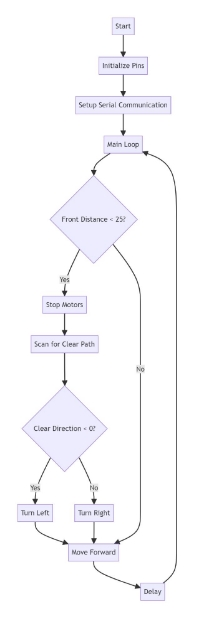
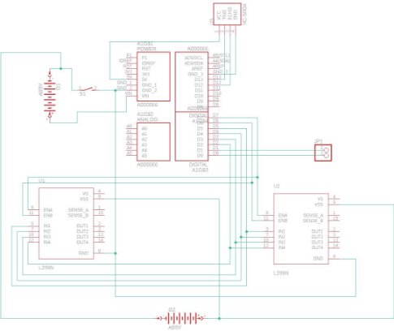

## "Schildkröte" Autonome Roboter-Projekt

****

## Präsentationen

[Erste Präsentation](https://www.canva.com/design/DAF0ck08wlY/KyTvZa1R2t_ZWuLOCTrIWg/edit?utm_content=DAF0ck08wlY&utm_campaign=designshare&utm_medium=link2&utm_source=sharebutton)

[Mittlere Präsentation](https://www.canva.com/design/DAF3NwGtKNY/gO03OJdvzaFCXvBd5bw7GQ/edit?utm_content=DAF3NwGtKNY&utm_campaign=designshare&utm_medium=link2&utm_source=sharebutton)

[Finale Präsentation](https://www.canva.com/design/DAF6i0d_T4A/OAscPg_fHkqIX4RX6LJBFw/edit?utm_content=DAF6i0d_T4A&utm_campaign=designshare&utm_medium=link2&utm_source=sharebutton)

## Übersicht
Das Projekt "Schildkröte", durchgeführt unter der Fakultät für Informatik und Elektrotechnik, Fachbereich Elektrotechnik der Universität Rostock im Wintersemester 2023/24, ist ein ambitioniertes Vorhaben, das auf die Konzeption und den Bau eines autonomen Roboters abzielt. Unter der Leitung von Iheb Mrabet und Max Balbach konzentriert sich das Projekt auf den Einsatz von Sensortechnologie zur Umgebungserfassung und autonomen Navigation, indem es Grundlagen der Robotik, Konstruktion, Elektronik und Programmierung zu einer kohäsiven Bildungs- und Entwicklungsplattform vereint.

## Projektziele
Das Ziel des "Schildkröte"-Projekts ist die Entwicklung eines kostengünstigen, autonomen Roboters, der sich für Bildungszwecke oder als Basis für weitere Entwicklungen eignet. Durch die Nutzung von Standardkomponenten und Open-Source-Programmierung betont das Projekt eine modulare und anpassungsfähige Plattform.

## Gerätebeschreibung
Die "Schildkröte" ist ein autonomer Roboter, der auf einer eigens erstellten Hülle basiert und durch eine Genuino 101 als Hauptsteuereinheit für die Software-Hardware-Interaktion angetrieben wird. Der Roboter ist mit einem Ultraschallsensor HC-SR04 für die Entfernungsmessung, einem Vierradantriebssystem, das durch DC-Motoren betrieben wird, und einem Batteriesystem für die Energieversorgung ausgestattet. Die Montage umfasst Motor-Treiber zur Steuerung der DC-Motoren, Batterien, eine selbstgebaute Leiterplatte für die Integration der Komponenten und einen manuellen Steuerschalter.

## Funktionen
- **Autonome Navigation:** Kontinuierliche Entfernungsmessung über den Ultraschallsensor, mit Logik für Navigationsentscheidungen basierend auf der Nähe zu Hindernissen.
- **Modulares Design:** Geeignet für verschiedene Aufgaben und Umgebungen, von logistischen Anwendungen bis hin zu Reinigungs- und Automatisierungsprojekten.
- **Mechanische Baugruppen:** Details zum Aufbau des Roboter-Gehäuses, einschließlich Dimensionen, Gestaltungsüberlegungen und Komponentenplatzierung für optimalen Schutz und Funktionalität.

## Elektronik
- **Schaltungsaufbau:** Integriert einen Genuino 101, Ultraschallsensor, DC-Motoren und Batterien mit Fokus auf effiziente Stromverteilung und Komponentenintegration.
- **Leiterplattenkonstruktion:** Von Design bis Fertigung, detaillierte Darstellung des Layouts, der Produktionsprozesse und der Montage elektronischer Bauteile.

## Programmierung
Nutzt die Arduino IDE zur Programmierung des Roboters, um ihm zu ermöglichen, Hindernisse autonom zu erkennen und zu vermeiden, sich durch Umgebungen zu navigieren und effektiv mit umgebenden Objekten zu interagieren.

|
PIN-Bezei

chnung
|Verbindungstyp|Beschreibung|PIN- Nummer|
| - | - | - | :- |
|in1|OUTPUT|
Steuert einen der

Motoren
|2|
|in2|OUTPUT|
Steuert einen der

Motoren
|3|
|in3|OUTPUT|
Steuert einen der

Motoren
|4|
|in4|OUTPUT|
Steuert einen der

Motoren
|5|
|trigPin|OUTPUT|Sendet Ultraschallsignale|13|
|echoPin|INPUT|Empfängt die reflektierten Ultraschallsignale|12|

Die Tabelle zeigt, welche PINs am Mikrocontroller für Motorsteuerung und Ultraschallsensorik zuständig sind, inklusive ihrer Funktionen und PIN-Nummern.

## Testen und Kalibrieren
Behandelt die Testprozesse, aufgetretene Probleme und Kalibrierungsmethoden, um Genauigkeit und Funktionalität des Roboters zu gewährleisten.

## Umweltverträglichkeit und Entsorgung
Betont den Einsatz von umweltfreundlichen Materialien und Komponenten, um eine einfache Entsorgung und minimalen ökologischen Fußabdruck zu gewährleisten.

## Zusätzliche Informationen
- **Strukturelle und elektronische Bauteile:** Aufschlüsselung der im Projekt verwendeten Komponenten, klassifiziert in mechanische und elektronische Gruppen.
- **Verwendete Software:** Listet die im Projekt genutzten Software-Tools auf, einschließlich Design-, Programmier- und Präsentationsanwendungen.

## Erklärungen
- **Eigenständigkeitserklärung:** Bestätigt die Originalität und selbständige Arbeit der Projektmitwirkenden, Iheb Mrabet und Max Balbach.

## Referenzen und Software
Bietet Links zu Literatur, im Projekt verwendeter Software und Präsentationen, die die Entwicklungsstadien des Projekts aufzeigen

.

## Anhänge
- **Schaltpläne:** Detaillierte Schemata des Schaltungsentwurfs und des PCB-Layouts.
- **Technischer Aufbau:** Fotos und Diagramme, die die Montage und den fertigen Aufbau des "Schildkröte"-Roboters illustrieren.

  
  
  
  
  
